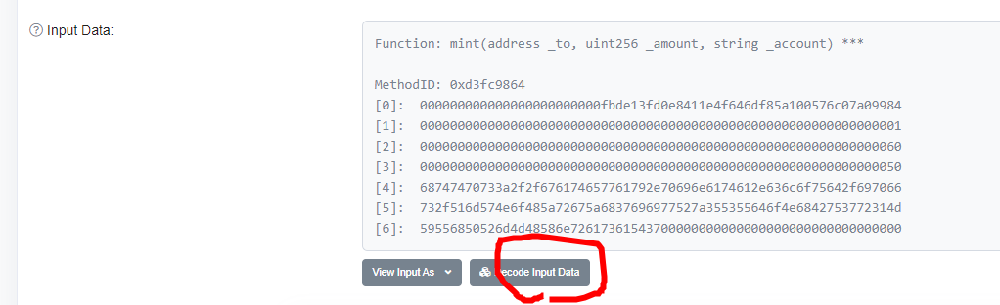

# NFT 만들기 [erc721]
참조 예제는 https://www.quicknode.com/guides/solidity/how-to-create-and-deploy-an-erc-721-nft


## NFT Metadata 생성
메타데이타는 실제적인 컨텐츠(이미지나 동영상) 와 이것을 참조하는 Json 파일 두가지로 나주어 집니다.

### IPFS 에 이미지 올리기
- ipfs에 이미지를 전송하는 방법 다양하나 [Pinata](https://app.pinata.cloud/) 에서 이미지를 올려보겠습니다.
- 이미지 업로드에대해서는 별도의 설명은 하지 않겠습니다.


cid (Hash Code) : QmSyNKS792FkY3zFL3QWYMCFea4kt2ccUHc8Qf7RvnAzNg


### JSON 파일 처리
CID를 카피한 후 JSON 파일을 만듦니다.

pondol-nft.json
```
{
    "name": "My First NFT Art",
    "description": "This image shows the true nature of NFT.",
    "image": "https://gateway.pinata.cloud/ipfs/QmSyNKS792FkY3zFL3QWYMCFea4kt2ccUHc8Qf7RvnAzNg",
    "tokenId": 1,
}
```
이미지와 마찬가지로 이것도 업로드한 후 url을 획득합니다.

Meta Url : https://gateway.pinata.cloud/ipfs/QmWNoHZrgZh7iiwRz5SUdoNhBu7r1MYUhPRmMHXnrasaT7

이제 리믹스에 접근합니다.(https://remix.ethereum.org/)
간략한 사용법에 대해서는 [ REMIX를 이용한 사용자 토큰 제작](../../token/ether/remix.md) 를 참조해 주시기 바랍니다.

pondol-ntf.sol
```
// SPDX-License-Identifier: MIT
pragma solidity 0.8.10;

import "https://github.com/0xcert/ethereum-erc721/src/contracts/tokens/nf-token-metadata.sol";
import "https://github.com/0xcert/ethereum-erc721/src/contracts/ownership/ownable.sol";

contract pondolNFT is NFTokenMetadata, Ownable {

  constructor() {
    nftName = "Pondol NFT";
    nftSymbol = "PONDOLNFT";

  }

  function mint(address _to, uint256 _tokenId, string calldata _uri) external onlyOwner {
    super._mint(_to, _tokenId);
    super._setTokenUri(_tokenId, _uri);
  }

}
```
pondol-ntf.sol 파일을 만듦니다.


컴파일
- compiler 버전을 현재 sol 파일의 pragma solidity 와 통일


버거그 없으면 배포를 하겠습니다.


MetaMask에서 Sign


약간의 시간 경과후 MetaMask에서 정상적으로 처리되었다는 결과 알림


Deployed Contract 섹션에 현재 배포한 Contract가 리스트 됩니다.


Mint 탭을 찾아 열기를 한 후
- _to : 본인의 MetaMask 상의 Address
- _tokenId: 1을 입력(처음이면. 다른 숫자를 넣어도 상관없지만 편의상)
- _url : 위에서 제작한 Meta Url 을 입력합니다.(https://gateway.pinata.cloud/ipfs/QmWNoHZrgZh7iiwRz5SUdoNhBu7r1MYUhPRmMHXnrasaT7)
모든 입력이 끝나면 transact를 클릭


Metamask에서 Sign 처리


Deployed Contract 섹션에tj tokenURI 항목에 _tokenId 에 Mint에서 넣은 _url을 입력(여기서는 1)
그리고 call을 누르면 Meta URl이 보이면 나만의 NTF  토큰이 생성 된 것입니다.


https://ropsten.etherscan.io/ 에서 정상적으로 처리되었는지 확인 해 보겠습니다.
https://ropsten.etherscan.io/tx/0x51ea45c3bcc04f0c894dba2d6422b40a55e5ea3f54b500837402ed62a734218e




짝짝짝 수고 많았습니다.
