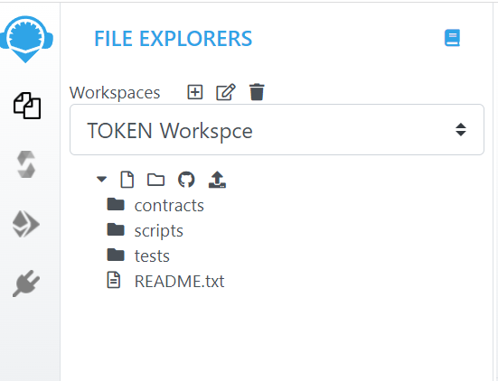

# REMIX를 이용한 사용자 토큰 제작
여기서는 Remix를 활용하여 신규 코인을 뚝딱 만들 예정입니다.


## 사전 준비
- MetaMask
- Remix

### MetaMask 설치
1. MetaMask는 이더리움 기반의 암호화폐 월렛이다.
1. [ 설치방법 참조](https://sh-safer.tistory.com/174) (검색하면 많은 정보가 있으므로 별도 언급은 하지 않는다)

### Remix 사용
Remix는 솔리디티 언어를 사용해서 이더리움 스마트 컨트랙트에 대한 통합개발 환경을 제공합니다.
별도설치없이 웹브라우저에서 사용하는 방법을 간단히 설명드립니다.
[ 리믹스 IDE - 브라우저](https://remix.ethereum.org/)
[ 리믹스 DOC ](https://remix-ide.readthedocs.io/en/latest/) 다양한 사용법

#### REMIX를 이용한 사용자 토큰 제작
토큰제작은 Solidity 파일작성, 컴파일, 배포 3단계로 이루어집니다.
##### Step 1 Solidity 파일작성
작업화면

새로운 파일 작성

PONDOL-TOKEN.sol 파일 생성

우측 Edit 화면에 아래의 PONDOL-TOKEN.sol 을 입력합니다.


PONDOL-TOKEN.sol
```
pragma solidity ^0.4.26;

// ----------------------------------------------------------------------------
// Sample token contract
//
// Symbol        : PONDOL
// Name          : PONDOL Token
// Total supply  : 1000000000000
// Decimals      : 6
// Owner Account : 0xAd61C057eD2cE6BB81f10eeC0192e3a7DEC848dc
//
// Enjoy.
//
// (c) by Idea Inven Doohee 2021. DM Licence.
// ----------------------------------------------------------------------------


// ----------------------------------------------------------------------------
// Lib: Safe Math
// ----------------------------------------------------------------------------
contract SafeMath {

    function safeAdd(uint a, uint b) public pure returns (uint c) {
        c = a + b;
        require(c >= a);
    }

    function safeSub(uint a, uint b) public pure returns (uint c) {
        require(b <= a);
        c = a - b;
    }

    function safeMul(uint a, uint b) public pure returns (uint c) {
        c = a * b;
        require(a == 0 || c / a == b);
    }

    function safeDiv(uint a, uint b) public pure returns (uint c) {
        require(b > 0);
        c = a / b;
    }
}


/**
ERC Token Standard #20 Interface
https://github.com/ethereum/EIPs/blob/master/EIPS/eip-20-token-standard.md
*/
contract ERC20Interface {
    function totalSupply() public constant returns (uint);
    function balanceOf(address tokenOwner) public constant returns (uint balance);
    function allowance(address tokenOwner, address spender) public constant returns (uint remaining);
    function transfer(address to, uint tokens) public returns (bool success);
    function approve(address spender, uint tokens) public returns (bool success);
    function transferFrom(address from, address to, uint tokens) public returns (bool success);

    event Transfer(address indexed from, address indexed to, uint tokens);
    event Approval(address indexed tokenOwner, address indexed spender, uint tokens);
}


/**
Contract function to receive approval and execute function in one call
Borrowed from MiniMeToken
*/
contract ApproveAndCallFallBack {
    function receiveApproval(address from, uint256 tokens, address token, bytes data) public;
}

/**
ERC20 Token, with the addition of symbol, name and decimals and assisted token transfers
*/
contract PONDOLToken is ERC20Interface, SafeMath {
    string public symbol;
    string public  name;
    uint8 public decimals;
    uint public _totalSupply;

    mapping(address => uint) balances;
    mapping(address => mapping(address => uint)) allowed;


    // ------------------------------------------------------------------------
    // Constructor
    // ------------------------------------------------------------------------
    constructor() public {
        symbol = "PONDOL"; // [수정] 본인의 토큰
        name = "PONDOL Token"; // [수정] 본인의 토큰 명
        decimals = 6; // [수정] 소숫점 몇째까지 거래 (USDT는 6이라서 저도 6으로 처리)
        _totalSupply = 1000000000000; //  [수정] 총 공급할 양
        balances[0xfBde13FD0E8411e4F646df85A100576c07A09984] = _totalSupply; //  [수정]이곳의 주소는 본인의 MetaMask 주소를 넣어 줄것
        emit Transfer(address(0), 0xfBde13FD0E8411e4F646df85A100576c07A09984, _totalSupply);
    }


    // ------------------------------------------------------------------------
    // Total supply
    // ------------------------------------------------------------------------
    function totalSupply() public constant returns (uint) {
        return _totalSupply  - balances[address(0)];
    }


    // ------------------------------------------------------------------------
    // Get the token balance for account tokenOwner
    // ------------------------------------------------------------------------
    function balanceOf(address tokenOwner) public constant returns (uint balance) {
        return balances[tokenOwner];
    }


    // ------------------------------------------------------------------------
    // Transfer the balance from token owner's account to to account
    // - Owner's account must have sufficient balance to transfer
    // - 0 value transfers are allowed
    // ------------------------------------------------------------------------
    function transfer(address to, uint tokens) public returns (bool success) {
        balances[msg.sender] = safeSub(balances[msg.sender], tokens);
        balances[to] = safeAdd(balances[to], tokens);
        emit Transfer(msg.sender, to, tokens);
        return true;
    }


    // ------------------------------------------------------------------------
    // Token owner can approve for spender to transferFrom(...) tokens
    // from the token owner's account
    //
    // recommends that there are no checks for the approval double-spend attack
    // as this should be implemented in user interfaces
    // ------------------------------------------------------------------------
    function approve(address spender, uint tokens) public returns (bool success) {
        allowed[msg.sender][spender] = tokens;
        emit Approval(msg.sender, spender, tokens);
        return true;
    }


    // ------------------------------------------------------------------------
    // Transfer tokens from the from account to the to account
    //
    // The calling account must already have sufficient tokens approve(...)-d
    // for spending from the from account and
    // - From account must have sufficient balance to transfer
    // - Spender must have sufficient allowance to transfer
    // - 0 value transfers are allowed
    // ------------------------------------------------------------------------
    function transferFrom(address from, address to, uint tokens) public returns (bool success) {
        balances[from] = safeSub(balances[from], tokens);
        allowed[from][msg.sender] = safeSub(allowed[from][msg.sender], tokens);
        balances[to] = safeAdd(balances[to], tokens);
        emit Transfer(from, to, tokens);
        return true;
    }


    // ------------------------------------------------------------------------
    // Returns the amount of tokens approved by the owner that can be
    // transferred to the spender's account
    // ------------------------------------------------------------------------
    function allowance(address tokenOwner, address spender) public constant returns (uint remaining) {
        return allowed[tokenOwner][spender];
    }


    // ------------------------------------------------------------------------
    // Token owner can approve for spender to transferFrom(...) tokens
    // from the token owner's account. The spender contract function
    // receiveApproval(...) is then executed
    // ------------------------------------------------------------------------
    function approveAndCall(address spender, uint tokens, bytes data) public returns (bool success) {
        allowed[msg.sender][spender] = tokens;
        emit Approval(msg.sender, spender, tokens);
        ApproveAndCallFallBack(spender).receiveApproval(msg.sender, tokens, this, data);
        return true;
    }


    // ------------------------------------------------------------------------
    // Don't accept ETH
    // ------------------------------------------------------------------------
    function () public payable {
        revert();
    }
}
```
##### Step 2 컴파일
컴파일 단계에서는 현재 프로그램의 오류를 확인하고 디버깅하는 단계입니다.
- Step 2-1:  compile 아이콘을 클릭
- Step 2-2:  좌측의 Compiler와 우측 solidity 파일의 버젼을 마추어줍니다.
solidity는 버전마다 문법이 상이하므로 반드시 통일 시켜 주어야 합니다.
- Step2-3 : 좌측하단의 Compile 버튼을 클릭하시고 에러가 없으면 다음 단계로 넘어 갑니다.


##### Step 3 배포
배포는 현재 작성된 solidity를 이더리움 네트워크에 올리는 작업니다.
여기서는 Ropsten 네트워크에 올리는 방식에 대해 설명드립니다.

- step3-1: 먼저 좌측의 배포 아이콘을 클릭합니다.
- step3-2: environment를 Injected Web3로 선택
현재는 Main network로 연결되어 있는 것을 보실 수 있습니다.
- step3-3: 기존에 설치된 MetaMask로 로그인 합니다.


##### Step 4 메타마스크 Ropsten 네트워크로 변경
상단에서 네트워크를 Ropsten 테스트 네트워크로 변경합니다.

만약 테스트용 코인이 없으면 테스트 코인을 충전합니다.

###### 테스트 코인 획득
아래 url로가서 Ropsten 용 테스트 코인을 획득할 수 있습니다.
[ https://faucet.ropsten.be ](https://faucet.ropsten.be)
[ https://faucet.dimensions.network ](https://faucet.dimensions.network)
[ https://faucet.metamask.io ](https://faucet.metamask.io)

##### Step 5 배포
태스트용 코인이 충분하면 이제 배포를 하겠습니다.
Contract를 현재 contract로 선택한 후 "Deploy"를 하시면됩니다.


MetaMask에서 배포에 관련한 비용이 뜨 "확인"을 누르면 이더네트워크에 Contract가 배포됩니다.


배포가 완료되면 contract Address를 카피하여 실제적으로 네트워크 상에 배포되었는지 확인합니다.


##### 트랜젝션확인
현재는 이더리움 메인 네트워크가 아니라 Ropsten 네트워크 이므로 아래 url로 접속하셨어 Contrace Address를 확인합니다.
[ https://ropsten.etherscan.io ](https://ropsten.etherscan.io)
PONDOL 토큰이 정상적으로 확인되었습니다.

MetaMask에도 내 토큰이 들어와 있는지 확인해 볼께요
보이지 않을 경우 token을 추가해 주시면 됩니다.
아래 "import tokens"를 클릭하시고


<p>토큰계약주소 입력</p>
<p>Add Custom Token] 클릭</p>


<p>다시한번 [Import Token] 클릭</p>


<p>다시 확인하시 PONDOL 토큰이 완성되었습니다.</p>


