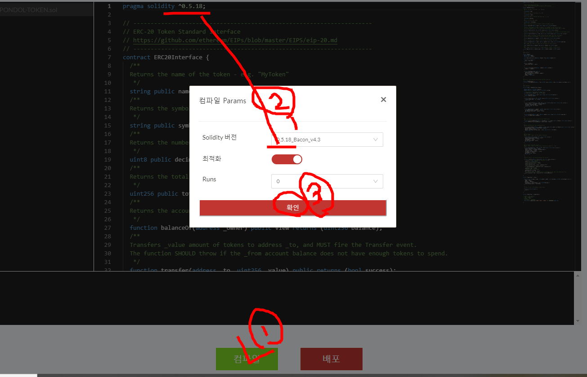

# 트론에서 ERC20 사용자 토큰 만들기
트론은 테스트넷으로 몇몇을 제공하는데 NILE에서의 사용자 토큰을 만들어 보겠습니다.
참조로 SHASTA에서는 컨터렉트 배포를 https://shasta.tronscan.org/#/contracts/contract-Compiler 에서 하시면 됩니다.

## 사전 준비
- TRONLink

크롬에서 Tronlink 확장프로그램을 추가합니다
- https://chrome.google.com/webstore/category/extensions?hl=ko 크롬에서 크롬웹 스토어 접속

나머지 설치법에 대해서는 별도 설명을 드리지는 않겠습니다.


## PONDOL-TOKEN.sol 파일 생성
아래 파일을 PONDOL-TOKEN.sol로 저장합니다.
PONDOL-TOKEN.sol
```
pragma solidity ^0.5.18;

// ---------------------------------------------------------------------
// ERC-20 Token Standard Interface
// https://github.com/ethereum/EIPs/blob/master/EIPS/eip-20.md
// ---------------------------------------------------------------------
contract ERC20Interface {
  /**
  Returns the name of the token - e.g. "MyToken"
   */
  string public name;
  /**
  Returns the symbol of the token. E.g. "HIX".
   */
  string public symbol;
  /**
  Returns the number of decimals the token uses - e. g. 8
   */
  uint8 public decimals;
  /**
  Returns the total token supply.
   */
  uint256 public totalSupply;
  /**
  Returns the account balance of another account with address _owner.
   */
  function balanceOf(address _owner) public view returns (uint256 balance);
  /**
  Transfers _value amount of tokens to address _to, and MUST fire the Transfer event.
  The function SHOULD throw if the _from account balance does not have enough tokens to spend.
   */
  function transfer(address _to, uint256 _value) public returns (bool success);
  /**
  Transfers _value amount of tokens from address _from to address _to, and MUST fire the Transfer event.
   */
  function transferFrom(address _from, address _to, uint256 _value) public returns (bool success);
  /**
  Allows _spender to withdraw from your account multiple times, up to the _value amount.
  If this function is called again it overwrites the current allowance with _value.
   */
  function approve(address _spender, uint256 _value) public returns (bool success);
  /**
  Returns the amount which _spender is still allowed to withdraw from _owner.
   */
  function allowance(address _owner, address _spender) public view returns (uint256 remaining);
  /**
  MUST trigger when tokens are transferred, including zero value transfers.
   */
  event Transfer(address indexed _from, address indexed _to, uint256 _value);
  /**
  MUST trigger on any successful call to approve(address _spender, uint256 _value).
    */
  event Approval(address indexed _owner, address indexed _spender, uint256 _value);
}

/**
Owned contract
 */
contract Owned {
  address public owner;
  address public newOwner;

  event OwnershipTransferred(address indexed _from, address indexed _to);

  constructor () public {
    owner = msg.sender;
  }

  modifier onlyOwner {
    require(msg.sender == owner);
    _;
  }

  function transferOwnership(address _newOwner) public onlyOwner {
    newOwner = _newOwner;
  }

  function acceptOwnership() public {
    require(msg.sender == newOwner);
    emit OwnershipTransferred(owner, newOwner);
    owner = newOwner;
    newOwner = address(0);
  }
}

/**
Function to receive approval and execute function in one call.
 */
contract TokenRecipient {
  function receiveApproval(address _from, uint256 _value, address _token, bytes memory _extraData) public;
}

/**
Token implement
 */
contract Token is ERC20Interface, Owned {

  mapping (address => uint256) _balances;
  mapping (address => mapping (address => uint256)) _allowed;

  // This notifies clients about the amount burnt
  event Burn(address indexed from, uint256 value);

  function balanceOf(address _owner) public view returns (uint256 balance) {
    return _balances[_owner];
  }

  function transfer(address _to, uint256 _value) public returns (bool success) {
    _transfer(msg.sender, _to, _value);
    return true;
  }

  function transferFrom(address _from, address _to, uint256 _value) public returns (bool success) {
    require(_value <= _allowed[_from][msg.sender]);
    _allowed[_from][msg.sender] -= _value;
    _transfer(_from, _to, _value);
    return true;
  }

  function approve(address _spender, uint256 _value) public returns (bool success) {
    _allowed[msg.sender][_spender] = _value;
    emit Approval(msg.sender, _spender, _value);
    return true;
  }

  function allowance(address _owner, address _spender) public view returns (uint256 remaining) {
    return _allowed[_owner][_spender];
  }

  /**
  Owner can transfer out any accidentally sent ERC20 tokens
   */
  function transferAnyERC20Token(address tokenAddress, uint tokens) public onlyOwner returns (bool success) {
    return ERC20Interface(tokenAddress).transfer(owner, tokens);
  }

  /**
  Approves and then calls the receiving contract
   */
  function approveAndCall(address _spender, uint256 _value, bytes memory _extraData) public returns (bool success) {
    TokenRecipient spender = TokenRecipient(_spender);
    approve(_spender, _value);
    spender.receiveApproval(msg.sender, _value, address(this), _extraData);
    return true;
  }

  /**
  Destroy tokens.
  Remove `_value` tokens from the system irreversibly
    */
  function burn(uint256 _value) public returns (bool success) {
    require(_balances[msg.sender] >= _value);
    _balances[msg.sender] -= _value;
    totalSupply -= _value;
    emit Burn(msg.sender, _value);
    return true;
  }

  /**
  Destroy tokens from other account.
  Remove `_value` tokens from the system irreversibly on behalf of `_from`.
    */
  function burnFrom(address _from, uint256 _value) public returns (bool success) {
    require(_balances[_from] >= _value);
    require(_value <= _allowed[_from][msg.sender]);
    _balances[_from] -= _value;
    _allowed[_from][msg.sender] -= _value;
    totalSupply -= _value;
    emit Burn(_from, _value);
    return true;
  }

  /**
  Internal transfer, only can be called by this contract
    */
  function _transfer(address _from, address _to, uint _value) internal {
    // Prevent transfer to 0x0 address. Use burn() instead
    require(_to != address(0x0));
    // Check if the sender has enough
    require(_balances[_from] >= _value);
    // Check for overflows
    require(_balances[_to] + _value > _balances[_to]);
    // Save this for an assertion in the future
    uint previousBalances = _balances[_from] + _balances[_to];
    // Subtract from the sender
    _balances[_from] -= _value;
    // Add the same to the recipient
    _balances[_to] += _value;
    emit Transfer(_from, _to, _value);
    // Asserts are used to use static analysis to find bugs in your code. They should never fail
    assert(_balances[_from] + _balances[_to] == previousBalances);
  }

}

contract CommonToken is Token {

  constructor(string memory _name, string memory _symbol, uint8 _decimals, uint256 _initialSupply) public {
    name = _name;
    symbol = _symbol;
    decimals = _decimals;
    totalSupply = _initialSupply * 10 ** uint256(decimals);
    _balances[msg.sender] = totalSupply;
  }

  /**
  If ether is sent to this address, send it back.
   */
  function () external payable {
    revert();
  }

}

contract PondolToken is CommonToken {

// pondol's token publish
// name : pondol Token
// symbol : PONDOL
// decimals : 6
// init supply : 1000000000
  constructor() CommonToken("PONDOL TOKEN", "PONDOL", 6, 1000000000) public {}

}
```

## 배포URL 접속
https://nile.tronscan.org/#/contracts/contract-Compiler 에 접속합니다.

방금 생성한 PONDOL-TOKEN.sol 파일을 업로드 합니다.


아래 컴파일 버튼을 클릭하면 창이 하나 뜨는데 이곳에서
solidity 버젼을 문서의 버젼과 같게 마추어 줍니다.
그리고 확인 버튼


컴파일이 성공적으로 끝나면 1번과 같은 메시지가 나오고 정상적인 배포를 클릭해 줍니다.


컨트렉트 이름을 PondolToken으로 선택합니다.(본인의 편의상 소스상의 토큰명)


sign
이때 필요한 테슽트 코인은 https://nileex.io/join/getJoinPage 에서 획득하실 수 있습니다.
별도의 설명은 이곳에서는 하지 않겠습니다.


배포가 완료되면 아래메시지가 출력됩니다.

```
Successful deployed contract 'PondolToken'. Cost: 231.04088 TRX, 0 energy. Transaction confirm here 8b73074b35cc20c9f62aaa456c167f8848987b53b28f02bf75562c5236790832
Contract address:  TCyeG8z6kNKF5hegFoj7vgxCpxJRytL31t
```

정상적인 배포가 되었는지 확인해 보겠습니다.
https://nile.tronscan.org/#/transaction/8b73074b35cc20c9f62aaa456c167f8848987b53b28f02bf75562c5236790832


https://nile.tronscan.org/#/contract/TCyeG8z6kNKF5hegFoj7vgxCpxJRytL31t/code


## 토큰입력
tron 토큰은 배포후에도 몇몇 후 작업을 해 주어야합니다.
https://nile.tronscan.org/#/tokens/create/Type 로 들어가서 토큰입력
- 토큰입력 > 유형


- 토큰입력 > 입력


- 토큰입력 > 확인


- 토큰입력 > 확인 > Sign [TronLink]


- 토큰입력 > 결과

지갑 - 토큰발행 클릭
https://nile.tronscan.org/#/wallet/tokensCreate

## 토큰발행
추가로 여기서는 거래소에 등록하거나 기타 매핑을 선택할 수 있습니다.
Create a Trading Pair 를 클릭하여 추가 정보를 입력하겠습니다.


## TRONLInk에서 확인하기
트론링크에 배포한 Token이 존재하는지 확인


없을 경우 추가한다.


PONDOL 토큰이 추가된 것을 확인 할 수 있다.


